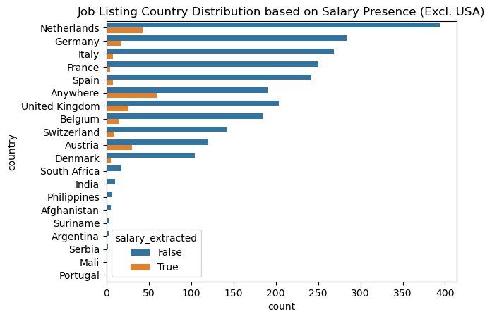

# Data Science Job Market Analysis

This repository serves as a complete analysis of the Data Science Job Market as of March 2023, as a prospective salary
indicator and skills checklists for students graduating from the Bachelor of Advanced Computing Sciences (DACS) at 
Maastricht University, the Netherlands. 

## Contents
1. [Research Scope](https://github.com/trav-d13/data_madness/README.md#research-scope) 
2. [Results](https://github.com/trav-d13/data_madness/README.md#results) 
3. [Implementation](https://github.com/trav-d13/data_madness/README.md#implementation)
   1. [Data Collection](https://github.com/trav-d13/data_madness/README.md#implementation)
   2. [Data Cleaning](https://github.com/trav-d13/data_madness/README.md#implementation)
   3. [Exploratory Data Analysis and Modelling](https://github.com/trav-d13/data_madness/README.md#implementation)
4. [Reproduceability](https://github.com/trav-d13/data_madness/README.md#reproduceability)
   1. [Dependencies](https://github.com/trav-d13/data_madness/README.md#reproduceability)
   2. [Troubleshooting](https://github.com/trav-d13/data_madness/README.md#reproduceability)

## 1. Research Scope
Key research questions of the analysis include: 
1. What is the expected salary of a graduating DACS student in the current job market? 
2. What are skills in high demand in the current job market
3. How has DACS prepared students to enter the job market, in terms of in demand skills. 

## 2. Results

## Video Demonstration
This video provides a short 2-minute overview of the completed analysis and discoveries. 

[](https://youtu.be/72cyQKITGjs)

The key points and graphs are listed below


Predominantly European and US jobs were scraped and gathered. Smaller hotspots include: Dubai, South Africa, 
Singapore, and Canada.  For a full list of scraped countries please review [collection.ipynb](collection.ipynb)


However, not all scraped job postings contained salary information, as countries have varied specifications 
regarding salary transparency. 



Removing the US for a clearer image of the salary transparency of remainder of the job postings. 
It must be noted that **Anywhere** is remote working, and it has become the second-largest source of salary transparent 
job listings scraped. 


From the job listings with available salary information, the required skills/ tools were extracted,
forming the skill/ tool demand visualization. Python, Machine Learning, and SQL being the top three requirements 
for any prospective data science position. 


Each country's salary ranges were converted into Euro's as a base country providing direct comparisons. 
It must be noted that these ranges include all Data Science job positions from Junior Data Scientists, 
Senior Data Scientist, and Data Scientist project managers. 
It is worthwhile noting that **Anywhere** or remote Data Science Positions have the second highest media salary value


Three models were trained to generate an estimate salary from a set of skills/ tools:
1. LassoCV Regression model
2. Decision Tree
3. Random Forest Model

The best performing model is the Random Forest, with a redidual of approximately 10000 Euros in its predictions. For further information on the above visualizations and more in-depth explanations, please review [eda.ipynb](eda.ipynb)

## 3. Implementation
### i. Data Collection
The data collection makes use of [SerpAPI](https://serpapi.com/), a freely accessible web-scraping tool, allowing 
scraping of multiple search engines including Google. This was utilized to target Google Job listings in order to gather 
current Data Science job offerings.

The Jupyter Notebook performing data extraction is `collection.ipynb`
The collected data is stored in `data.csv`.

### ii. Data Cleaning 
The scraped Google job listings are returned in an unstructured format. Multiple cleaning processes are required in order 
to generate meaningful data, ranging from NLP Question and Answer models, skill keyword extraction, and dealing with 
outliers, missing values, etc. 

The Jupyter Notebook performing the data cleaning is `pipeline.ipynb`. 
The cleaned data is stored in `data_clean.csv`.

Note: At each stage of the data cleaning, the data is stored in order to avoid repeated computation. 
These interim stores include: `data_cache/data_salaries.csv`, `data_cache/data_countries.csv`, `data_cache/data_country.csv`, `data_salaries`.

### iii. Exploratory Data Analysis and Modelling
The data was explored further using EDA techniques and prepared for modelling purposes. 
Three models were utilized, a standard Linear Regression model using Lasso Regularization, 
a Decision Tree Regression Model, and a Random Forest Regression Model. 

The Jupyter Notebook performing the EDA and Modelling is `eda.ipynb`. 

## 3. Reproduceability
To reproduce the research at a future date, all the code has been open-sourced and provided for free under a MIT public licence for non-commerical activities.

### i. Dependencies
To ease setup a conda environment file has been used such that all dependencies can be installed from file:
```
conda env create -f data_madness_env.yml
```

After creating, activate the environment:
```
conda activate data_madness
```

### ii. Troubleshooting

#### GoogleSearch import fails with conda environment

If an error occurs in
```
from serpapi import GoogleSearch
```

run
```
pip install google-search-results
```
